<h2>Tensorflow-Tiled-Image-Segmentation-Sessile-Polyp (2024/05/07)</h2>

This is the first experimental Image Segmentation project for Sessile-Polyp (Oral Cavity Derived Cancer) based on
the <a href="https://github.com/sarah-antillia/Tensorflow-Image-Segmentation-API">Tensorflow-Image-Segmentation-API</a>, and
<a href="https://drive.google.com/file/d/1ASU3q3tp4Benvu4_4O7Fx5eZaRdD1Dr_/view?usp=sharing">Sessile-Polyp-ImageMask-Dataset-V1.zip</a>.
 

Actual Image Segmentation Sample for an image. 
<table>
<tr>
<th>Input: image</th>
<th>Mask (ground_truth)</th>
<th>Prediction: inferred_mask_merged</th>
</tr>
<tr>
<td>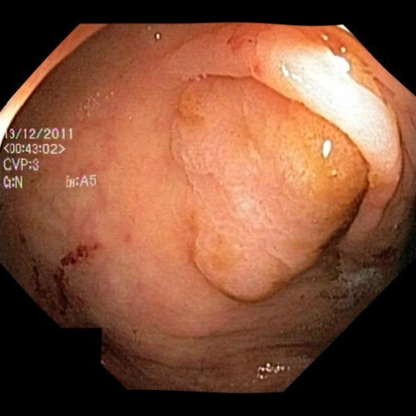</td>

<td>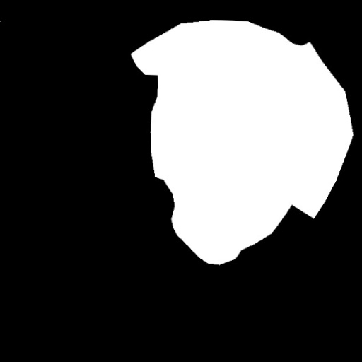</td>
<td>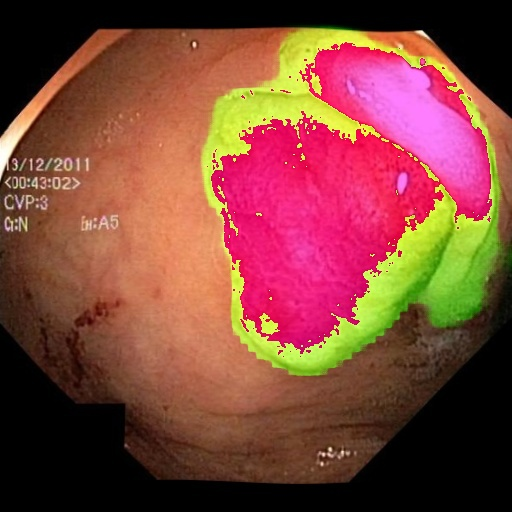</td>
</tr>
</table>

 
In this experiment, we have used the simple UNet Model 
<a href="./src/TensorflowUNet.py">TensorflowSlightlyFlexibleUNet</a> for this Oral Cancer Segmentation. 
As shown in <a href="https://github.com/sarah-antillia/Tensorflow-Image-Segmentation-API">Tensorflow-Image-Segmentation-API</a>.
you may try other Tensorflow UNet Models: 

<li><a href="./src/TensorflowSwinUNet.py">TensorflowSwinUNet.py</a></li>
<li><a href="./src/TensorflowMultiResUNet.py">TensorflowMultiResUNet.py</a></li>
<li><a href="./src/TensorflowAttentionUNet.py">TensorflowAttentionUNet.py</a></li>
<li><a href="./src/TensorflowEfficientUNet.py">TensorflowEfficientUNet.py</a></li>
<li><a href="./src/TensorflowUNet3Plus.py">TensorflowUNet3Plus.py</a></li>
<li><a href="./src/TensorflowDeepLabV3Plus.py">TensorflowDeepLabV3Plus.py</a></li>

 

<h3>1. Dataset Citation</h3>
The original dataset used here has been taken from the following web-site. 
<a href="https://paperswithcode.com/dataset/kvasir-sessile-dataset">
Kvasir-Sessile dataset (Sessile polyps from Kvasir-SEG)  
Introduced by Jha et al. in Kvasir-SEG: A Segmented Polyp Dataset 
</b>
</a>
<pre>
The Kvasir-SEG dataset includes 196 polyps smaller than 10 mm classified as Paris class 1 
sessile or Paris class IIa. We have selected it with the help of expert gastroenterologists. 
We have released this dataset separately as a subset of Kvasir-SEG. We call this subset Kvasir-Sessile.

The dataset is publicly available. It can be downloaded from here:

https://drive.google.com/drive/folders/1OjsStQh6yuKz0bG6OA3BzmIiXDZILg7V?usp=sharing

If you use this dataset, please cite our paper,

https://ieeexplore.ieee.org/stamp/stamp.jsp?tp=&arnumber=9314114

/https://arxiv.org/pdf/1911.07069.pdf

</pre>

 

<h3>
<a id="2">
2 Sessile-Polyp ImageMask Dataset
</a>
</h3>
 If you would like to train this Sessile-Polyp Segmentation model by yourself,
 please download the dataset from the google drive 
<a href="https://drive.google.com/file/d/1ASU3q3tp4Benvu4_4O7Fx5eZaRdD1Dr_/view?usp=sharing">Sessile-Polyp-ImageMask-Dataset-V1.zip</a>.
 
Please expand the downloaded ImageMaskDataset and place it under <b>./dataset</b> folder to be
<pre>
./dataset
└─Sessile-Polyp
    ├─test
    │   ├─images
    │   └─masks
    ├─train
    │   ├─images
    │   └─masks
    └─valid
        ├─images
        └─masks
</pre>

<b>Sessile-Polyp Dataset Statistics</b> 
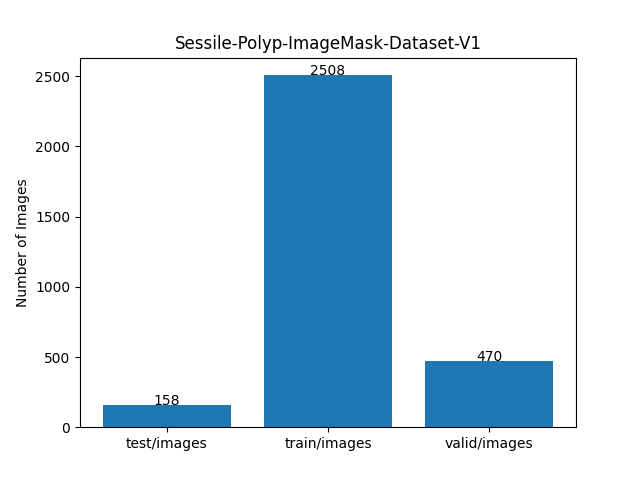 
 
As shown above, the number of images of train and valid dataset is not necessarily large. 
 

 
<b>Train_images_sample</b> 
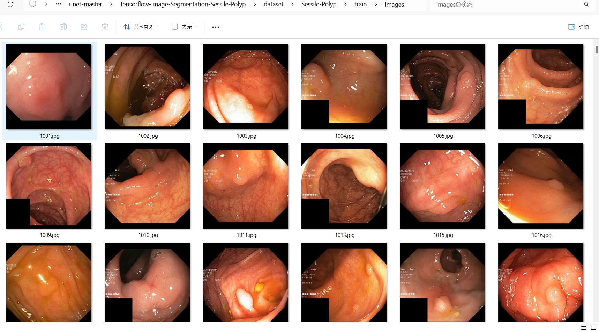
 
<b>Train_masks_sample</b> 
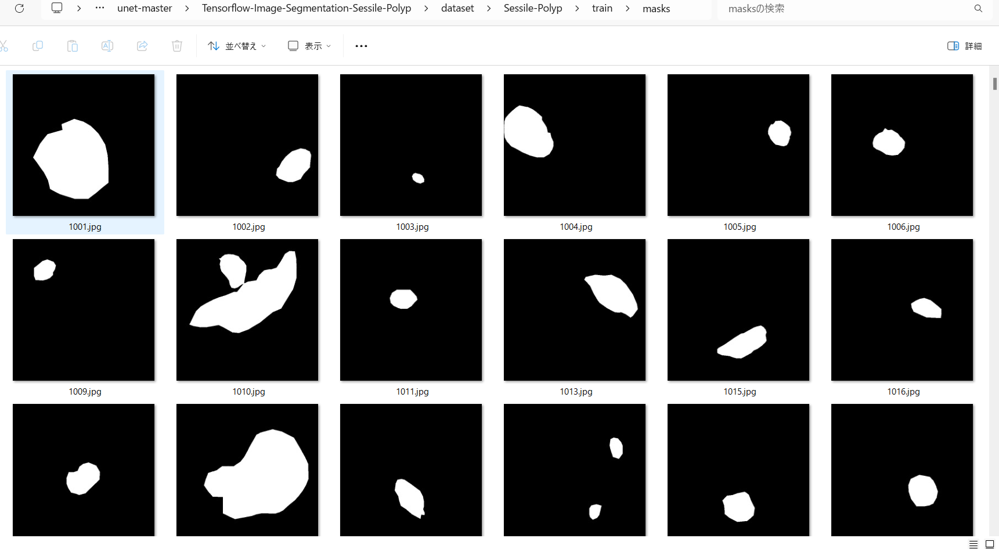
 

<h3>
4 Train TensorflowUNet Model
</h3>
 We have trained Sessile-Polyp TensorflowUNet Model by using the following
<a href="./projects/TensorflowSlightlyFlexibleUNet/Sessile-Polyp/train_eval_infer.config"> <b>train_eval_infer.config</b></a> file.  
Please move to ./projects/Sessile-Polyp and run the following bat file. 
<pre>
>1.train.bat
</pre>
, which simply runs the following command. 
<pre>
>python ../../../src/TensorflowUNetTrainer.py ./train_eval_infer.config
</pre>
<pre>
; train_eval_infer.config
; 2024/05/07 (C) antillia.com

[model]
model         = "TensorflowUNet"
generator     = False
image_width    = 512
image_height   = 512
image_channels = 3
input_normalize = True
num_classes    = 1
base_filters   = 16
base_kernels   = (5,5)
num_layers     = 8
dropout_rate   = 0.07
learning_rate  = 0.0001
clipvalue      = 0.5
dilation       = (2,2)
loss           = "bce_dice_loss"
metrics        = ["binary_accuracy"]
show_summary   = False

[dataset]
color_order   = "bgr"

[train]
epochs        = 100
batch_size    = 2
patience      = 10
;metrics       = ["iou_coef", "val_iou_coef"]
metrics       = ["binary_accuracy", "val_binary_accuracy"]
model_dir     = "./models"
eval_dir      = "./eval"
image_datapath = "../../../dataset/Sessile-Polyp/train/images/"
mask_datapath  = "../../../dataset/Sessile-Polyp/train/masks/"
create_backup  = False
learning_rate_reducer = True
reducer_patience      = 4
save_weights_only = True

[eval]
image_datapath = "../../../dataset/Sessile-Polyp/valid/images/"
mask_datapath  = "../../../dataset/Sessile-Polyp/valid/masks/"

[test] 
image_datapath = "../../../dataset/Sessile-Polyp/test/images/"
mask_datapath  = "../../../dataset/Sessile-Polyp/test/masks/"

[infer] 
images_dir    = "./mini_test/images"
output_dir    = "./mini_test_output"
merged_dir   = "./mini_test_output_merged"
;binarize      = True
sharpening   = True

[segmentation]
colorize      = True
black         = "black"
white         = "green"
blursize      = None

[mask]
blur      = True
blur_size = (3,3)
binarize  = False
;
threshold = 110
</pre>

The training process has just been stopped at epoch 100 as shown below.  
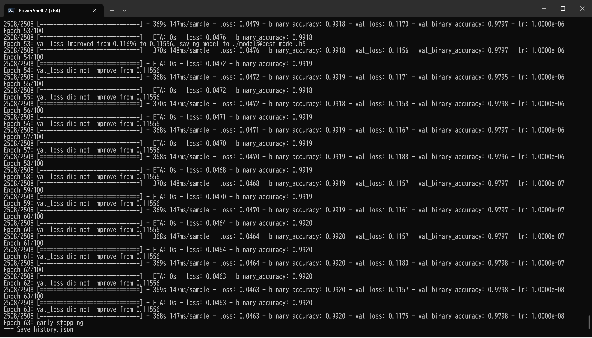 
 
 
<a href="./projects/TensorflowSlightlyFlexibleUNet/Sessile-Polyp/eval/train_metrics.csv">train_metrics.csv</a> 
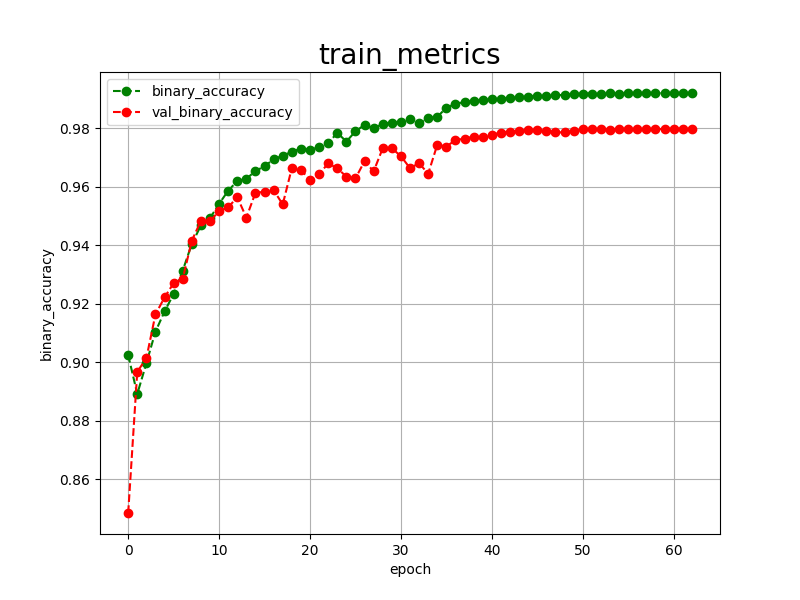 

 
<a href="./projects/TensorflowSlightlyFlexibleUNet/Sessile-Polyp/eval/train_losses.csv">train_losses.csv</a> 
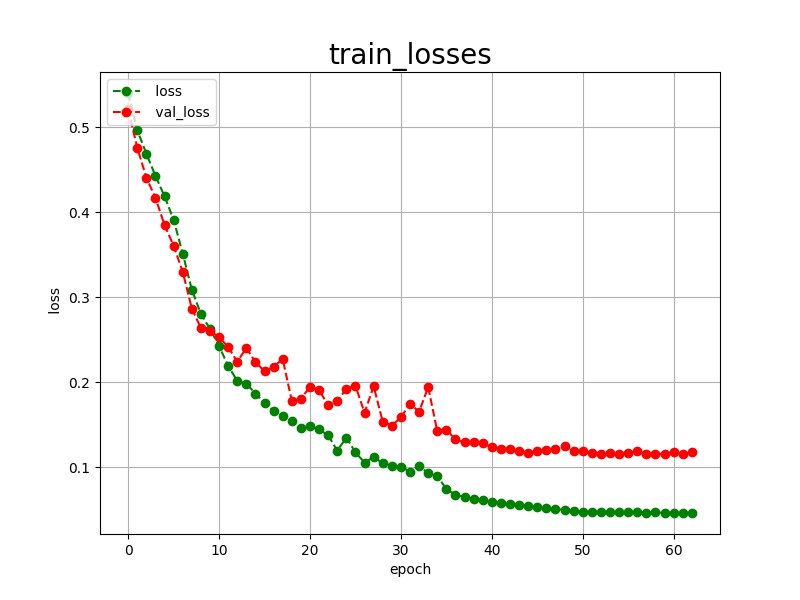 

 

<h3>
5 Evaluation
</h3>
Please move to a <b>./projects/TensorflowSlightlyFlexibleUNet/Sessile-Polyp</b> folder, 
and run the following bat file to evaluate TensorflowUNet model for Sessile-Polyp. 
<pre>
./2.evaluate.bat
</pre>
<pre>
python ../../../src/TensorflowUNetEvaluator.py ./train_eval_infer_aug.config
</pre>
Evaluation console output: 
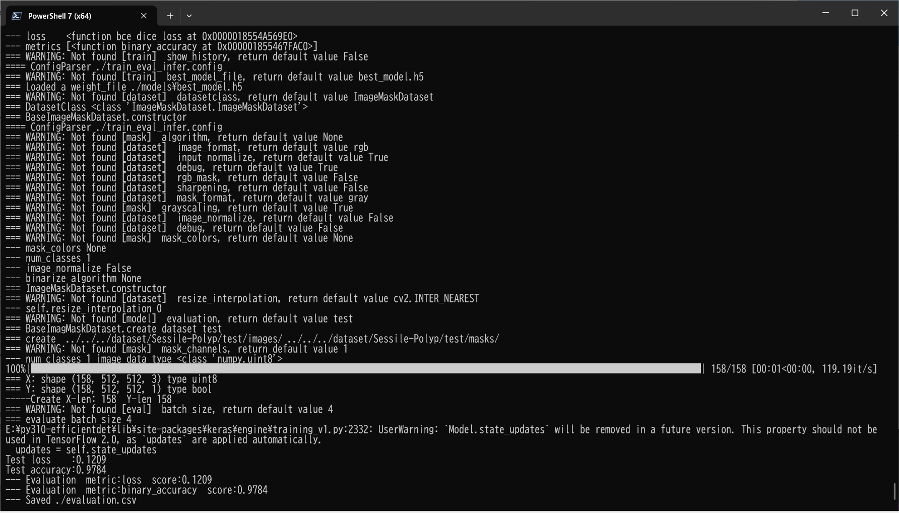
  
<a href="./projects/TensorflowSlightlyFlexibleUNet/Sessile-Polyp/evaluation.csv">evaluation.csv</a> 
The loss (bce_dice_loss) score for this test dataset is relatively low, and accuracy heigh as shown below. 
<pre>
loss,0.1209
binary_accuracy,0.9784
</pre>
<h3>
6 Inference
</h3>
Please move to a <b>./projects/TensorflowSlightlyFlexibleUNet/Sessile-Polyp</b> folder 
,and run the following bat file to infer segmentation regions for images by the Trained-TensorflowUNet model for Sessile-Polyp. 
<pre>
./3.infer.bat
</pre>
<pre>
python ../../../src/TensorflowUNetInferencer.py ./train_eval_infer_aug.config
</pre>
mini_test_images 
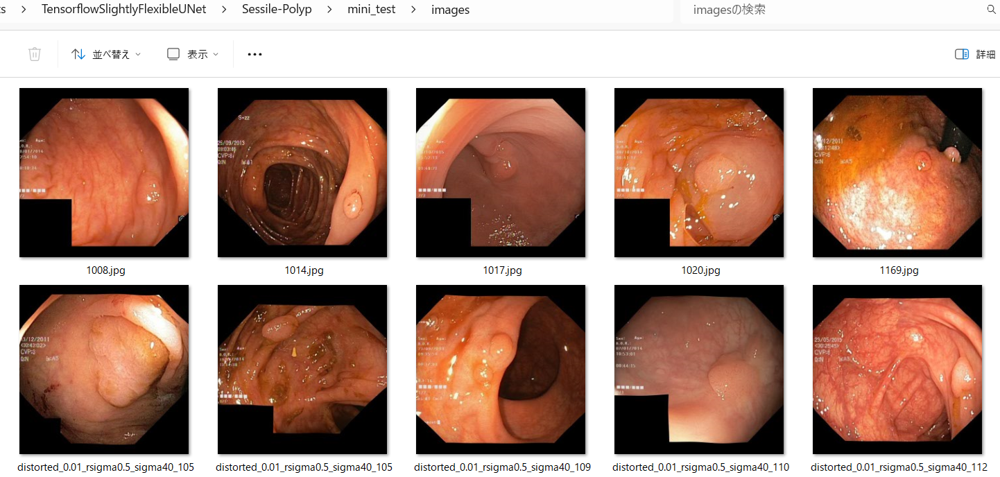 
mini_test_mask(ground_truth) 
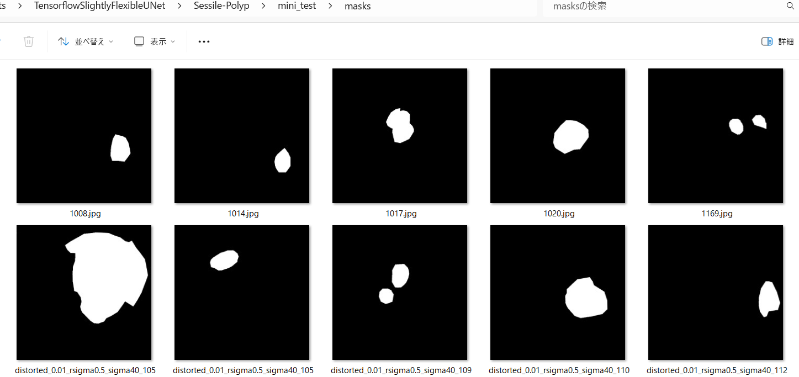 

Inferred test masks (colorized as green) 
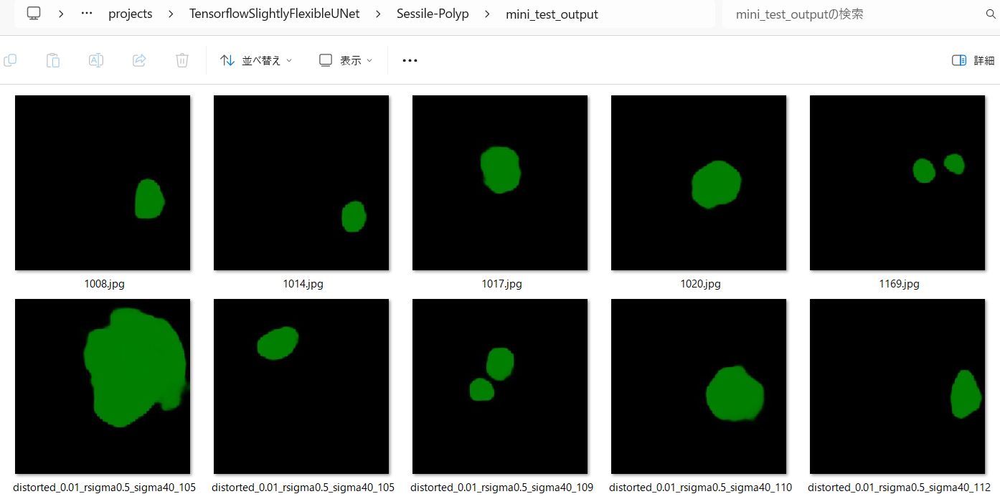 
 

Inferred test masks_merged 
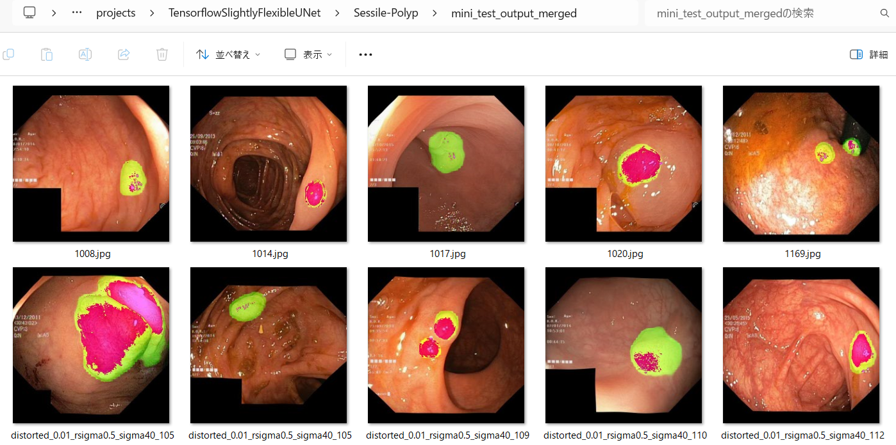 
 

<b>Enlarged images and masks </b> 

<table>
<tr>
<th>Image</th>
<th>Mask (ground_truth)</th>
<th>Inferred-mask-merged</th>
</tr>

<tr>
<td>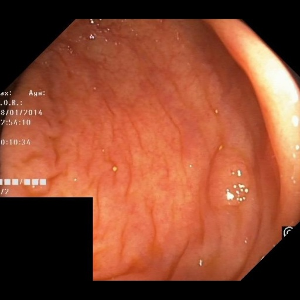</td>
<td>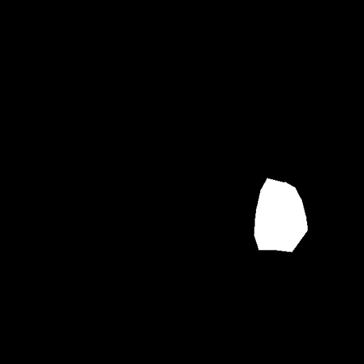</td>
<td>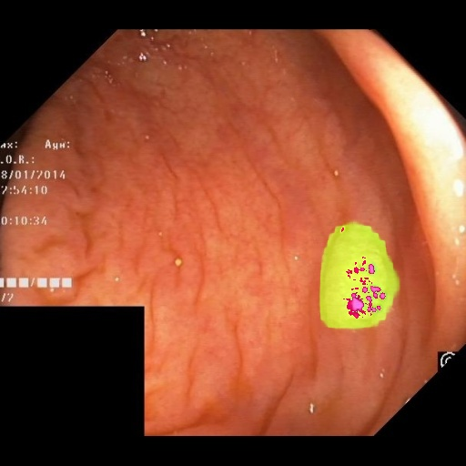</td>
</tr>

<tr>
<td>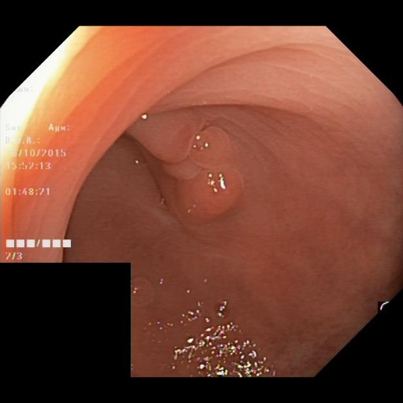</td>
<td>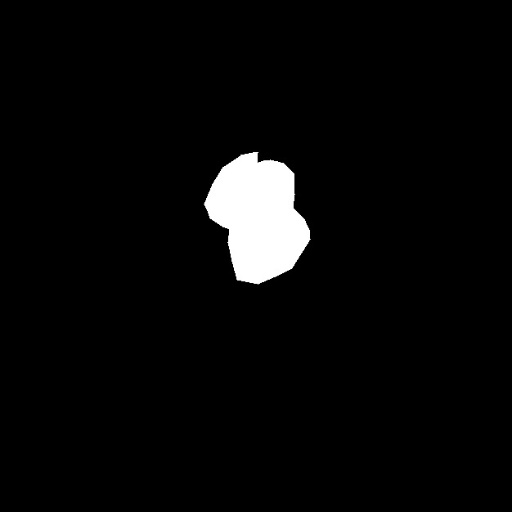</td>
<td>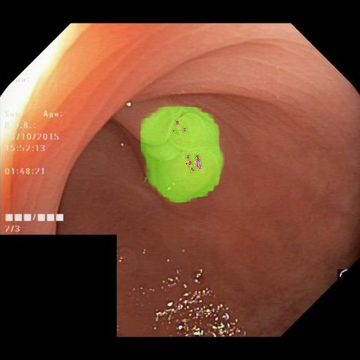</td>
</tr>

<tr>
<td></td>
<td></td>
<td></td>
</tr>

<tr>
<td>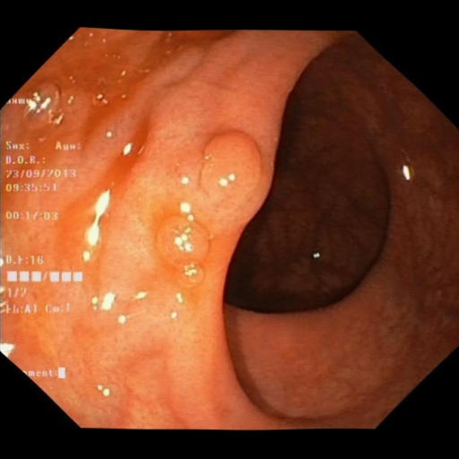</td>
<td></td>
<td>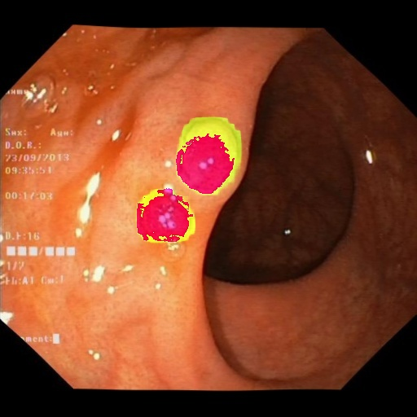</td>
</tr>
<tr>
<td>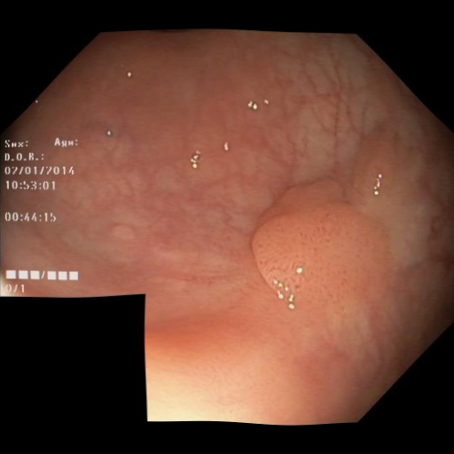</td>
<td>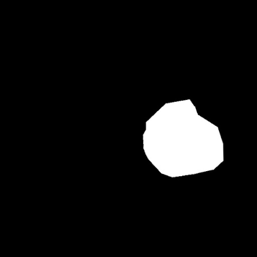</td>
<td>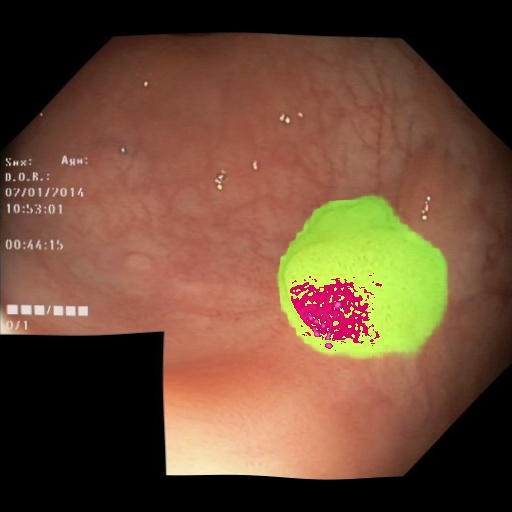</td>
</tr>

</table>
 
 

<h3>
References
</h3>

<b>1. Kvasir-Sessile dataset (Sessile polyps from Kvasir-SEG)  
Introduced by Jha et al. in Kvasir-SEG: A Segmented Polyp Dataset 
</b>
<pre>
https://paperswithcode.com/dataset/kvasir-sessile-dataset
</pre>

<b>2. ImageMask-Dataset-Sessile-Polyp</b> 
Toshiyuki Arai antillia.com 
<pre>
https://github.com/sarah-antillia/ImageMask-Dataset-Sessile-Polyp
</pre>

